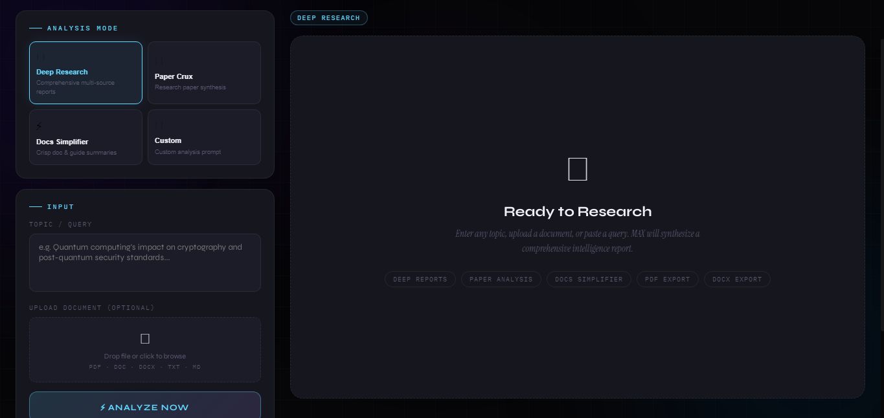
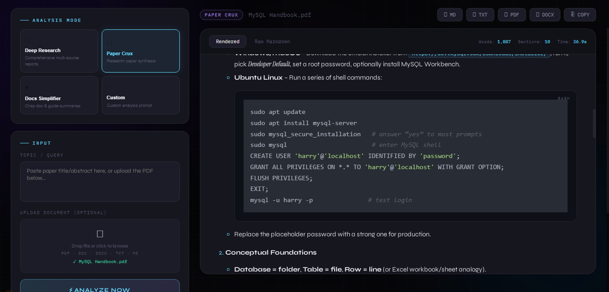
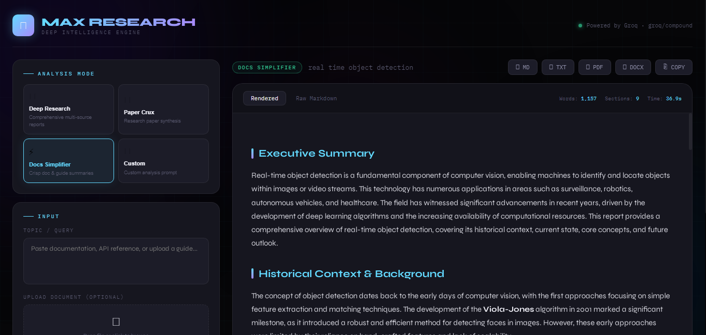

# ⚡ MAX Research — Deep Intelligence Engine

> A locally-hosted AI research agent that autonomously browses, reads, and synthesizes information into comprehensive reports — powered by Groq/Compound.

MAX Research is purpose-built for depth. It's not a chatbot you have a conversation with — you give it a topic or a document, and it produces a thorough, well-structured analysis. Each of the four modes has a specialized system prompt engineered to extract a specific kind of insight. Reports stream token-by-token with live markdown rendering, syntax-highlighted code blocks, and real-time word count.

The reason it uses **Groq/Compound** specifically is that it's not just a language model — it's an agentic model that combines GPT-OSS with autonomous web search tool calls. So when you ask it to research something, it doesn't just reason from training data — it actually goes out and browses the web, pulls in current information, and incorporates it into the report. This makes a dramatic difference in accuracy for anything recent or fast-moving.

---
---
## Interface Preview

<p align="center">
interface
  
  Doc crux
  
  Deep research
  
</p>

---
## Why MAX Research?

Most AI tools give you a chatbot. MAX Research gives you a research assistant. The difference is:

- **Structured output** — every mode produces a report with defined sections, not a wall of prose
- **Live web search** — Compound Beta actually browses the internet during generation, so you get current data, not just what the model learned during training
- **Document-aware** — upload a PDF paper, a DOCX guide, or a markdown file and the model will reason over it directly
- **Multiple export formats** — take your report straight to Word, PDF, or markdown without copy-pasting
- **Runs locally** — your own Flask server, your own API key, no third-party data handling

---

## Modes

### 📡 Deep Research
The main mode. Give it any topic and it produces a full report structured into nine sections: executive summary, historical context, current state, core concepts and mechanisms, multiple perspectives and debates, real-world applications and case studies, challenges and limitations, future outlook, and conclusions. Good for anything from technical subjects to policy topics to competitive landscapes.

### 🧬 Paper Crux
Upload a research paper (or paste an abstract) and get back a plain-English breakdown: what problem it solves, why it matters, how they did it, what they found, what's actually new (if anything), what it gets wrong or misses, practical implications, and a 5-sentence summary you can actually use. Saves hours on literature reviews.

### ⚡ Docs Simplifier
Paste or upload any documentation — a README, API reference, man page, or technical guide — and get back a structured cheat sheet: one-line explanation, quick start, core concepts only, key commands/functions, the 20% of features you'll use 80% of the time, gotchas that will trip you up, practical examples, and an ultra-condensed reference at the end.

### 🎯 Custom Analysis
You write the instruction, it follows it. The custom instruction field sets the lens through which the model approaches the topic. Combine it with file upload for things like: upload a business plan and instruct "analyze as a skeptical Series A investor", or upload a codebase README and instruct "identify security concerns".

---

## Requirements

- Python 3.7 or higher (tested on 32-bit and 64-bit Windows, Linux, Mac)
- A free Groq API key — get one at [console.groq.com](https://console.groq.com)

---

## Installation

Clone or download the project, then install dependencies:

```bash
pip install flask groq python-dotenv python-docx PyPDF2 markdown beautifulsoup4
```

> **Note on PDF generation:** No PDF library is required. MAX Research ships with a built-in zero-dependency PDF writer (`MinimalPDF` class inside `app.py`) written specifically to avoid the `fpdf2` / `reportlab` compatibility issues on Python 3.7 32-bit. It generates valid PDF 1.4 using only Python's stdlib and the 14 standard PDF fonts.

---

## Configuration

Edit the `.env` file in the project root:

```env
GROQ_API_KEY=your_key_here
FLASK_SECRET_KEY=any_random_string_for_sessions
```

### Changing the model

The model is set on line ~26 of `app.py`:

```python
MODEL = "compound-beta"              # Recommended: Llama 3.3 70B + live web search
# MODEL = "llama-3.3-70b-versatile"  # No web search, slightly faster
# MODEL = "llama-3.1-8b-instant"     # Much faster, lighter output quality
```

`compound-beta` is the recommended default. If you don't need web search and want lower latency, switch to `llama-3.3-70b-versatile`.

---

## Running

```bash
python app.py
```

Open `http://localhost:5000` in your browser. That's it.

---

## File Support

### Input formats
Upload any of these and the model will read them directly:

| Format | How it's processed |
|---|---|
| `.pdf` | Text extracted page-by-page via PyPDF2 |
| `.docx` / `.doc` | Paragraphs extracted via python-docx |
| `.txt` | Read and decoded as UTF-8 |
| `.md` | Read directly, passed as-is to the model |

You can also drag and drop files onto the upload area. The first 12,000 characters of extracted text are sent to the model (enough for most papers and docs).

### Output formats
Download your finished report as:

| Format | Notes |
|---|---|
| `.md` | Raw markdown — works great in Obsidian, Notion, Typora, GitHub |
| `.txt` | Plain text with all markdown formatting stripped |
| `.pdf` | Generated by the built-in MinimalPDF writer — no external library needed |
| `.docx` | Fully formatted Word document with heading styles, bold/italic, monospace code font, and bullet lists |

---

## Project Structure

```
max-research/
├── app.py                  # Flask backend, Groq API, streaming, file parsers, PDF writer
├── .env                    # API keys — do not commit this
├── requirements.txt        # Python dependencies
└── templates/
    └── index.html          # Entire frontend in a single file
                            #   Marked.js       — markdown → HTML rendering
                            #   Highlight.js    — syntax highlighting (atom-one-dark)
                            #   SSE client      — real-time token streaming
                            #   localStorage    — persistent session history
```

The whole frontend is one HTML file with no build step, no node_modules, no bundler. CDN imports only.

---

## API Reference

| Endpoint | Method | Body | Description |
|---|---|---|---|
| `/` | `GET` | — | Serves the main UI |
| `/api/modes` | `GET` | — | Returns all modes with names, descriptions, and system prompts |
| `/api/research/stream` | `POST` | `multipart/form-data`: `mode`, `topic`, optional `file`, optional `custom_instruction` | Returns an SSE stream of JSON events |
| `/api/export` | `POST` | `{ content, title, format }` | Returns a file attachment in the requested format |

### SSE event format (`/api/research/stream`)

```
data: {"type": "start", "mode": "deep_research", "topic": "..."}

data: {"type": "chunk", "text": "## Executive Summary\n\n"}
data: {"type": "chunk", "text": "Quantum computing..."}
... (one event per token batch)

data: {"type": "done", "full_content": "## Executive Summary\n\n..."}
```

On error: `data: {"type": "error", "message": "..."}`

---

## UI Features

- **Mode selector** — four cards, click to switch, the topic placeholder updates accordingly
- **Drag-and-drop upload** — drop a file anywhere on the upload area
- **Live streaming** — tokens appear as they're generated, with a blinking cursor
- **Rendered / Raw tabs** — toggle between the formatted HTML view and raw markdown
- **Stats bar** — word count, section count, and generation time update live
- **Export bar** — appears after generation completes, one click to download in any format
- **Copy button** — copies the raw markdown to clipboard
- **Session history** — last 20 reports saved to localStorage, click any to reload it
- **Keyboard shortcut** — `Ctrl+Enter` / `Cmd+Enter` submits from the topic field

---

## Troubleshooting

**`AuthenticationError` on startup or first request**
Your `GROQ_API_KEY` in `.env` is wrong, missing, or has trailing whitespace. Double-check it matches exactly what's in the Groq console.

**`ImportError: No module named X`**
Run `pip install -r requirements.txt` again. If you're on Python 3.7, make sure you're installing into the right environment.

**Streaming doesn't work / output appears all at once**
Some browser extensions (ad blockers, privacy tools like uBlock) intercept and buffer SSE responses. Try disabling extensions or use a fresh browser profile.

**Port 5000 already in use**
Edit the last line of `app.py`:
```python
app.run(debug=True, port=5001)  # or any available port
```

**PDF looks wrong in my viewer**
The built-in PDF writer uses standard Type1 fonts and PDF 1.4. It's been tested in Chrome, Firefox, Adobe Acrobat, and Sumatra. Some older or minimal viewers may not render it correctly — Chrome's built-in PDF viewer works reliably.

**Paper Crux gives generic output**
Make sure you're uploading the actual paper PDF rather than just typing a title. The model needs the content, not just the name.

---

## Stack

| Layer | Technology |
|---|---|
| LLM | Groq `compound-beta` — Llama 3.3 70B + autonomous web search |
| Backend | Flask 2.x, python-docx, PyPDF2, python-dotenv |
| Streaming | Flask SSE via `stream_with_context` |
| Frontend | Vanilla JS — no framework, no build step |
| Markdown | Marked.js 9.x |
| Syntax highlighting | Highlight.js 11.x (atom-one-dark theme) |
| PDF generation | MinimalPDF — custom class in app.py, zero dependencies |
| Fonts | Syne (UI), IBM Plex Mono (code), Instrument Serif (italics) |

---
## Author

**Samin Saikia**

Python Developer focused on backend systems, AI agents, and practical software tools.

- GitHub: https://github.com/Samin-Saikia
- LinkedIn: https://www.linkedin.com/in/samin-saikia-b7660b3a1/

Built as an experimental research project exploring multi-agent software development pipelines.

---

## License

MIT# MAX-Research-Deep-Research-Intelligence-Engine


=======
# ⚡ MAX Research — Deep Intelligence Engine


> A locally-hosted AI research agent that autonomously browses, reads, and synthesizes information into comprehensive reports — powered by Groq/Compound.

MAX Research is purpose-built for depth. It's not a chatbot you have a conversation with — you give it a topic or a document, and it produces a thorough, well-structured analysis. Each of the four modes has a specialized system prompt engineered to extract a specific kind of insight. Reports stream token-by-token with live markdown rendering, syntax-highlighted code blocks, and real-time word count.

The reason it uses **Groq/Compound** specifically is that it's not just a language model — it's an agentic model that combines GPT-OSS with autonomous web search tool calls. So when you ask it to research something, it doesn't just reason from training data — it actually goes out and browses the web, pulls in current information, and incorporates it into the report. This makes a dramatic difference in accuracy for anything recent or fast-moving.

---

---
## Interface Preview

<p align="center">
interface
  
  Doc crux
  
  Deep research
  
</p>

---

## Workflow

```
┌─────────────────────────────────────────────────────────────────────┐
│  ⚡ NEXUS RESEARCH           ● Powered by Groq · Compound Beta      │
├──────────────────────┬──────────────────────────────────────────────┤
│  Analysis Mode       │  [DEEP RESEARCH]          ↓MD ↓TXT ↓PDF ↓DOCX│
│  ┌────┐ ┌────┐       │                                              │
│  │ 📡 │ │ 🧬 │       │  ## Executive Summary                        │
│  │Deep│ │Crux│       │  Quantum computing represents a fundamental  │
│  └────┘ └────┘       │  shift in computational paradigms...         │
│  ┌────┐ ┌────┐       │                                              │
│  │ ⚡ │ │ 🎯 │       │  ## Historical Context                       │
│  │Docs│ │Cust│       │  The theoretical foundations were laid by... │
│  └────┘ └────┘       │                                              │
│                      │  ```python                                    │
│  Topic / Query       │  from qiskit import QuantumCircuit           │
│  ┌──────────────┐    │  qc = QuantumCircuit(2, 2)                   │
│  │              │    │  ```                                          │
│  └──────────────┘    │                                              │
│  [ ⚡ Analyze Now ]  │  Words: 3,241 · Sections: 9 · Time: 12.4s   │
└──────────────────────┴──────────────────────────────────────────────┘
```

---

## Why MAX Research?

Most AI tools give you a chatbot. MAX Research gives you a research assistant. The difference is:

- **Structured output** — every mode produces a report with defined sections, not a wall of prose
- **Live web search** — Compound Beta actually browses the internet during generation, so you get current data, not just what the model learned during training
- **Document-aware** — upload a PDF paper, a DOCX guide, or a markdown file and the model will reason over it directly
- **Multiple export formats** — take your report straight to Word, PDF, or markdown without copy-pasting
- **Runs locally** — your own Flask server, your own API key, no third-party data handling

---

## Modes

### 📡 Deep Research
The main mode. Give it any topic and it produces a full report structured into nine sections: executive summary, historical context, current state, core concepts and mechanisms, multiple perspectives and debates, real-world applications and case studies, challenges and limitations, future outlook, and conclusions. Good for anything from technical subjects to policy topics to competitive landscapes.

### 🧬 Paper Crux
Upload a research paper (or paste an abstract) and get back a plain-English breakdown: what problem it solves, why it matters, how they did it, what they found, what's actually new (if anything), what it gets wrong or misses, practical implications, and a 5-sentence summary you can actually use. Saves hours on literature reviews.

### ⚡ Docs Simplifier
Paste or upload any documentation — a README, API reference, man page, or technical guide — and get back a structured cheat sheet: one-line explanation, quick start, core concepts only, key commands/functions, the 20% of features you'll use 80% of the time, gotchas that will trip you up, practical examples, and an ultra-condensed reference at the end.

### 🎯 Custom Analysis
You write the instruction, it follows it. The custom instruction field sets the lens through which the model approaches the topic. Combine it with file upload for things like: upload a business plan and instruct "analyze as a skeptical Series A investor", or upload a codebase README and instruct "identify security concerns".

---

## Requirements

- Python 3.7 or higher (tested on 32-bit and 64-bit Windows, Linux, Mac)
- A free Groq API key — get one at [console.groq.com](https://console.groq.com)

---

## Installation

Clone or download the project, then install dependencies:

```bash
pip install flask groq python-dotenv python-docx PyPDF2 markdown beautifulsoup4
```

> **Note on PDF generation:** No PDF library is required. MAX Research ships with a built-in zero-dependency PDF writer (`MinimalPDF` class inside `app.py`) written specifically to avoid the `fpdf2` / `reportlab` compatibility issues on Python 3.7 32-bit. It generates valid PDF 1.4 using only Python's stdlib and the 14 standard PDF fonts.

---

## Configuration

Edit the `.env` file in the project root:

```env
GROQ_API_KEY=your_key_here
FLASK_SECRET_KEY=any_random_string_for_sessions
```

### Changing the model

The model is set on line ~26 of `app.py`:

```python
MODEL = "compound-beta"              # Recommended: Llama 3.3 70B + live web search
# MODEL = "llama-3.3-70b-versatile"  # No web search, slightly faster
# MODEL = "llama-3.1-8b-instant"     # Much faster, lighter output quality
```

`compound-beta` is the recommended default. If you don't need web search and want lower latency, switch to `llama-3.3-70b-versatile`.

---

## Running

```bash
python app.py
```

Open `http://localhost:5000` in your browser. That's it.

---

## File Support

### Input formats
Upload any of these and the model will read them directly:

| Format | How it's processed |
|---|---|
| `.pdf` | Text extracted page-by-page via PyPDF2 |
| `.docx` / `.doc` | Paragraphs extracted via python-docx |
| `.txt` | Read and decoded as UTF-8 |
| `.md` | Read directly, passed as-is to the model |

You can also drag and drop files onto the upload area. The first 12,000 characters of extracted text are sent to the model (enough for most papers and docs).

### Output formats
Download your finished report as:

| Format | Notes |
|---|---|
| `.md` | Raw markdown — works great in Obsidian, Notion, Typora, GitHub |
| `.txt` | Plain text with all markdown formatting stripped |
| `.pdf` | Generated by the built-in MinimalPDF writer — no external library needed |
| `.docx` | Fully formatted Word document with heading styles, bold/italic, monospace code font, and bullet lists |

---

## Project Structure

```
max-research/
├── app.py                  # Flask backend, Groq API, streaming, file parsers, PDF writer
├── .env                    # API keys — do not commit this
├── requirements.txt        # Python dependencies
└── templates/
    └── index.html          # Entire frontend in a single file
                            #   Marked.js       — markdown → HTML rendering
                            #   Highlight.js    — syntax highlighting (atom-one-dark)
                            #   SSE client      — real-time token streaming
                            #   localStorage    — persistent session history
```

The whole frontend is one HTML file with no build step, no node_modules, no bundler. CDN imports only.

---

## API Reference

| Endpoint | Method | Body | Description |
|---|---|---|---|
| `/` | `GET` | — | Serves the main UI |
| `/api/modes` | `GET` | — | Returns all modes with names, descriptions, and system prompts |
| `/api/research/stream` | `POST` | `multipart/form-data`: `mode`, `topic`, optional `file`, optional `custom_instruction` | Returns an SSE stream of JSON events |
| `/api/export` | `POST` | `{ content, title, format }` | Returns a file attachment in the requested format |

### SSE event format (`/api/research/stream`)

```
data: {"type": "start", "mode": "deep_research", "topic": "..."}

data: {"type": "chunk", "text": "## Executive Summary\n\n"}
data: {"type": "chunk", "text": "Quantum computing..."}
... (one event per token batch)

data: {"type": "done", "full_content": "## Executive Summary\n\n..."}
```

On error: `data: {"type": "error", "message": "..."}`

---

## UI Features

- **Mode selector** — four cards, click to switch, the topic placeholder updates accordingly
- **Drag-and-drop upload** — drop a file anywhere on the upload area
- **Live streaming** — tokens appear as they're generated, with a blinking cursor
- **Rendered / Raw tabs** — toggle between the formatted HTML view and raw markdown
- **Stats bar** — word count, section count, and generation time update live
- **Export bar** — appears after generation completes, one click to download in any format
- **Copy button** — copies the raw markdown to clipboard
- **Session history** — last 20 reports saved to localStorage, click any to reload it
- **Keyboard shortcut** — `Ctrl+Enter` / `Cmd+Enter` submits from the topic field

---

## Troubleshooting

**`AuthenticationError` on startup or first request**
Your `GROQ_API_KEY` in `.env` is wrong, missing, or has trailing whitespace. Double-check it matches exactly what's in the Groq console.

**`ImportError: No module named X`**
Run `pip install -r requirements.txt` again. If you're on Python 3.7, make sure you're installing into the right environment.

**Streaming doesn't work / output appears all at once**
Some browser extensions (ad blockers, privacy tools like uBlock) intercept and buffer SSE responses. Try disabling extensions or use a fresh browser profile.

**Port 5000 already in use**
Edit the last line of `app.py`:
```python
app.run(debug=True, port=5001)  # or any available port
```

**PDF looks wrong in my viewer**
The built-in PDF writer uses standard Type1 fonts and PDF 1.4. It's been tested in Chrome, Firefox, Adobe Acrobat, and Sumatra. Some older or minimal viewers may not render it correctly — Chrome's built-in PDF viewer works reliably.

**Paper Crux gives generic output**
Make sure you're uploading the actual paper PDF rather than just typing a title. The model needs the content, not just the name.

---

## Stack

| Layer | Technology |
|---|---|
| LLM | Groq `groq/compound` — GPT-OSS + autonomous web search |
| Backend | Flask 2.x, python-docx, PyPDF2, python-dotenv |
| Streaming | Flask SSE via `stream_with_context` |
| Frontend | Vanilla JS — no framework, no build step |
| Markdown | Marked.js 9.x |
| Syntax highlighting | Highlight.js 11.x (atom-one-dark theme) |
| PDF generation | MinimalPDF — custom class in app.py, zero dependencies |
| Fonts | Syne (UI), IBM Plex Mono (code), Instrument Serif (italics) |

---
## Author

**Samin Saikia**

Python Developer focused on backend systems, AI agents, and practical software tools.

- GitHub: https://github.com/Samin-Saikia
- LinkedIn: https://www.linkedin.com/in/samin-saikia-b7660b3a1/

Built as an experimental research project exploring multi-agent software development pipelines.

---